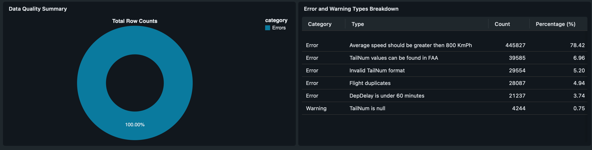

## Data Quality on Spark, Part 3: DQX

### Introduction
In this series of blog posts, we explore Data Quality from both a theoretical perspective and a practical implementation standpoint using the Spark framework. We also compare several tools designed to support Data Quality assessments.
Although the commercial market for Data Quality solutions is broad and full of capable products, the focus of this series is on open-source tools.
In this part, we continue exploring [Airline's](https://relational.fel.cvut.cz/dataset/Airline) dataset quality by the same Data Quality checks via [DQX](https://databrickslabs.github.io/dqx/) framework.

Previous parts:
- [Data quality on Spark, Part 1: GreatExpectations](https://medium.com/gitconnected/data-quality-on-spark-part-1-greatexpectations-fd4ffa126ca0)
- [Data Quality on Spark, Part 2: Soda](https://medium.com/gitconnected/data-quality-on-spark-part-2-soda-97d5d32e2d8b)

### Prerequisites
Please note: A Databricks workspace is a hard requirement for working with DQX for any operations.
[Databricks Free Edition](https://docs.databricks.com/aws/en/getting-started/free-edition) could be used for this tutorial.
Make sure you have: 
- Databricks workspace;
- Created a compute cluster or access to a Serverless cluster;
- Databricks CLI installed locally;
- Databricks CLI authentication configured for Databricks Connect (see [here](https://docs.databricks.com/aws/en/dev-tools/databricks-connect/python/tutorial-cluster#step-1-configure-databricks-authentication));

### DQX
DQX is a framework for data quality checks developed by Databricks. Unlike previously considered tools, DQX is designed to be used specifically for Spark, DeltaLake, and related stack in the Databricks environment. 
This brings with DQX a number of unique features for Spark, such as streaming support, splitting invalid data, and more, that you can find [here](https://databrickslabs.github.io/dqx/docs/motivation/).
An important consequence of the framework design, as will be shown later, DQX focuses on per-row validation. On the one hand, this does allow implementing for your pipelines features like [quarantining data](https://docs.databricks.com/aws/en/lakehouse-architecture/reliability/best-practices#automatically-rescue-invalid-or-nonconforming-data). On the other hand, for dataset-wise checks, a bit of additional work needs to be done.

It is worth mentioning that DQX provides out-of-the-box, powerful capabilities for automatic data check generation by:
- [Profiling data](https://databrickslabs.github.io/dqx/docs/guide/data_profiling/)
- [AI-Assisted quality checks generation](https://databrickslabs.github.io/dqx/docs/guide/ai_assisted_quality_checks_generation/)

However, these capabilities are out of the scope of this tutorial.

In the following sections, we will install and configure DQX, write quality checks using the same dimensions as in the previous parts, and prepare an evaluation report.
For brevity, the code examples are shortened. You can find the full codebase [here](https://github.com/IvannKurchenko/blog-data-quality-on-spark).

### Setup
First, we need to install the following packages using your preferred package manager:
 - [`databricks-labs-dqx`](https://pypi.org/project/databricks-labs-dqx/)
 - [`databricks-connect`](https://pypi.org/project/databricks-connect/)

"Databricks Connect" is not strictly required, but it allows us to run DQX checks locally.
More details on how to use DQX in the Databricks environment can be found in the following resources:
- [DQX demos](https://databrickslabs.github.io/dqx/docs/demos/)
- [DQX Cluster installation](https://databrickslabs.github.io/dqx/docs/demos/)

### Prepare data
DQX can validate both plain data frames and Delta tables. Since we have several different data sources (e.g., CSV for [FAA Database](https://registry.faa.gov/aircraftinquiry/search/nnumberinquiry) and MariaDB connection for [Airline's](https://relational.fel.cvut.cz/dataset/Airline) database),
to unify access, let's move the data to the Unity catalog in the following tables:
```python
airline_id_df.write.mode("ignore").saveAsTable("airline_id") # Airline id dimension table
faa_tail_numbers_df.write.mode("ignore").saveAsTable("faa_tail_numbers") # FAA Database tail numbers table
flights_df.write.mode("ignore").saveAsTable("flights") # Flights table, that we will validate
```

### Creating data quality checks
Data quality checks in DQX can be defined as YAML/JSON configuration files, programmatically with Python API, or even stored in delta tables.
For the sake of simplicity, let's proceed with the Python API as the most straightforward way to define checks. More details about these options can be found [here](https://databrickslabs.github.io/dqx/docs/guide/quality_checks_definition/). 
DQX defines two main categories of checks:
- [Row-level checks](https://databrickslabs.github.io/dqx/docs/reference/quality_checks/#row-level-checks-reference) - apply a validation rule to each row individually.
- [Dataset-level checks](https://databrickslabs.github.io/dqx/docs/reference/quality_checks/#dataset-level-checks-reference) - although based on dataframe-wise statistics, the result is still written per row level. 

In Python API, [DQRowRule](https://databrickslabs.github.io/dqx/docs/reference/api/rule/#dqrowrule-objects) defines a single row check, while [DQDatasetRule](https://databrickslabs.github.io/dqx/docs/reference/api/rule/#dqdatasetrule-objects) defines a set of checks.
Let's see them in action by defining a check per each category for the `flights` table.

#### Category: Accuracy & Validity
Verification: 
> All values of `TailNum` column are valid "tail number" combinations (see [Aircraft registration](https://en.wikipedia.org/wiki/Aircraft_registration))

This verification can be easily done by checking a regular expression with the help of [regex_match](https://databrickslabs.github.io/dqx/docs/reference/api/check_funcs/#regex_match):
```python
DQRowRule(
    name="Invalid TailNum format",
    criticality="error",
    check_func=check_funcs.regex_match,
    column="TailNum",
    check_func_kwargs={
        "regex": "^N(?:[1-9]\\d{0,4}|[1-9]\\d{0,3}[A-Z]|[1-9]\\d{0,2}[A-Z]{2})$"
    },
),
```

Verification: 
> All values in column `OriginState` contain valid state abbreviations (see [States Abbreviations](https://www.faa.gov/air_traffic/publications/atpubs/cnt_html/appendix_a.html))

This verification can be implemented in a similar way, by explicitly enumerating the valid values with [is_in_list](https://databrickslabs.github.io/dqx/docs/reference/api/check_funcs/#is_in_list) check:
```python
DQRowRule(
    name="Invalid OriginState value",
    criticality="error",
    check_func=check_funcs.is_in_list,
    column="OriginState",
    check_func_kwargs={
        "allowed": STATE_CODES
    },
)
```

Verification: 
> All rows have `ActualElapsedTime` that is more than `AirTime`.

For this case DQX also provides out-of-the-box solution with [is_not_greater_than](https://databrickslabs.github.io/dqx/docs/reference/api/check_funcs/#is_not_greater_than) rule:
```python
import pyspark.sql.functions as F

DQRowRule(
    name="ActualElapsedTime that is more than AirTime",
    check_func=check_funcs.is_not_greater_than,
    column="AirTime",
    criticality="error",
    check_func_kwargs={
        "limit": F.col("ActualElapsedTime")
    }
)
```

#### Completeness
Verification:
> All values in columns `FlightDate`, `AirlineID`, `TailNum` are not null.

This verification can be implemented with the [is_not_null_and_not_empty](https://databrickslabs.github.io/dqx/docs/reference/api/check_funcs/#is_not_null_and_not_empty) check:
```python
DQRowRule(
    name="FlightDate is null",
    criticality="warn",
    check_func=check_funcs.is_not_null_and_not_empty,
    column="FlightDate",
),
DQRowRule(
    name="AirlineID is null",
    criticality="warn",
    check_func=check_funcs.is_not_null_and_not_empty,
    column="AirlineID",
),
DQRowRule(
    name="TailNum is null",
    criticality="warn",
    check_func=check_funcs.is_not_null_and_not_empty,
    column="TailNum",
)
```
#### Consistency & Integrity
Verification:
> All values in column `AirlineID` match `Code` in `L_AIRLINE_ID` table, etc.

There is another ready-to-use check for this case: [foreign_key](https://databrickslabs.github.io/dqx/docs/reference/api/check_funcs/#foreign_key).
The function validates whether the values from the tested table exist in the reference table:
```python
DQDatasetRule(
    check_func=check_funcs.foreign_key,
    check_func_kwargs={
        "columns": ["AirlineID"],
        "ref_columns": ["Code"],
        "ref_table": "airline_id"
    }
)
```

#### Credibility / Accuracy
Verification:
> At least 80% of `TailNum` column values can be found in [Federal Aviation Agency Database](https://www.faa.gov/licenses_certificates/aircraft_certification/aircraft_registry/releasable_aircraft_download)

Although this is another perfect fit for the previous `foreign_key` check, at least "80% of matches" requirement will be covered later by calculating the ration of specific errors: 
```python
DQDatasetRule(
    check_func=check_funcs.foreign_key,
    check_func_kwargs={
        "columns": ["AirlineID"],
        "ref_columns": ["Code"],
        "ref_table": "airline_id"
    }
)
```

#### Currentness / Currency
Verification:
> All values in column `FlightDate` are not older than 2016.

Another library function that does the job for us is: [is_data_fresh](https://databrickslabs.github.io/dqx/docs/reference/api/check_funcs/#is_data_fresh) that validates timestamp columns age.
However, there is one thing: we need to supply the maximum age in minutes:

```python
DQRowRule(
    name="Flights should not be older then 11 years.",
    column="FlightDate",
    criticality="error",
    check_func=check_funcs.is_data_fresh,
    check_func_kwargs={
        "max_age_minutes": int((11 * timedelta(days=365)).total_seconds() / 60)
    }
)
```

#### Reasonableness
Verification:
> Average speed calculated based on `AirTime` (in minutes) and `Distance` is close to the average cruise speed of modern aircraft - 885 KpH.

This is where the dataset rules step into the arena. But as with the previous `Credibility / Accuracy` check, we can validate the average against a single row, but we can't validate the whole dataset.
Because of that, let's keep the check at the row level. For this verification, we will need to use two checks for boundaries: [is_aggr_not_less_than](https://databrickslabs.github.io/dqx/docs/reference/api/check_funcs/#is_aggr_not_less_than) and [is_aggr_not_greater_than](https://databrickslabs.github.io/dqx/docs/reference/api/check_funcs/#is_aggr_not_greater_than).

```python
DQDatasetRule(
    name="Average speed should be greater than 800 KmPh",
    criticality="error",
    check_func=check_funcs.is_aggr_not_less_than,
    check_func_kwargs={
        "aggr_type": "avg",
        "column": speed_column,
        "limit": F.lit(800)
    }
),
DQDatasetRule(
    name="Average speed should be less then 900 KmPh",
    criticality="error",
    check_func=check_funcs.is_aggr_not_greater_than,
    check_func_kwargs={
        "aggr_type": "avg",
        "column": speed_column,
        "limit": F.lit(900)
    }
),
```

Verification:
> 90th percentile of `DepDelay` is under 60 minutes; 

Since we can't validate an aggregation result of the entire dataset, let's paraphrase the requirement to close one as "90% of `DepDelay` values should be under 60 minutes."
So, we can check each row individually with [is_not_greater_than](https://databrickslabs.github.io/dqx/docs/reference/api/check_funcs/#is_not_greater_than) check:
```python
DQRowRule(
    name="DepDelay is under 60 minutes",
    column="DepDelay",
    criticality="error",
    check_func=check_funcs.is_not_greater_than,
    check_func_kwargs={
        "limit": 60
    }
)
```
"90%" part of the requirement will be covered later by calculating the ratio of specific errors.

#### Uniqueness
Verification:
> The proportion of duplicates by `FlightDate`, `AirlineId`, `TailNum`, `OriginAirportID`, and `DestAirportID` is less than 10%.

Uniqueness verification itself can be easily covered with the [is_unique](https://databrickslabs.github.io/dqx/docs/reference/api/check_funcs/#is_unique) check with the following configuration:
```python
DQDatasetRule(
    name="Flight duplicates",
    criticality="error",
    check_func=check_funcs.is_unique,
    check_func_kwargs={
        "columns": ["FlightDate", "AirlineId", "TailNum", "OriginAirportID", "DestAirportID"]
    }
)
```

### Applying data quality checks
After having all checks in place, we can collect them into a single `all_checks` array and apply.
As it was mentioned earlier, the result of the application can be different: storing results, splitting dataframes into invalid and valid parts, etc.
More you can find in the [documentation](https://databrickslabs.github.io/dqx/docs/guide/quality_checks_apply/#programmatic-approach).
Our primary goal is to validate the dataset, so let's apply checks and get validation results:
```python
from databricks.labs.dqx.contexts.workspace_context import WorkspaceContext
from databricks.labs.dqx.engine import DQEngine
from databricks.labs.dqx.metrics_observer import DQMetricsObserver

# Create an observer for general metrics collection
observer = DQMetricsObserver(name="dq_metrics") 

# Create DQEngine instance to run checks
dq_engine = DQEngine(WorkspaceClient(), observer=observer)

# input_df - is a dataframe to validate; all_checks - is a list of checks to apply
valid_and_invalid_df, observation = dq_engine.apply_checks(input_df, all_checks)
```

The resulting `valid_and_invalid_df` is the original dataframe with additional columns `_errors` and `_warnings` that contain validation results.
The resulting dataframe can be stored for more detailed analysis and reporting via Databricks which can be created with DQX by default.

```python
quarantine_df = (
    valid_and_invalid_df
    .where((F.size(F.col("_errors")) > 0) | (F.size(F.col("_warnings")) > 0))
)
output_df = (
    valid_and_invalid_df
    .where((F.size(F.col("_errors")) == 0) | (F.size(F.col("_warnings")) == 0))
)
dq_engine.save_results_in_table(
    output_df=output_df,
    quarantine_df=quarantine_df,
    output_config=OutputConfig("default.default.dqx_output", mode="overwrite"),
    quarantine_config=OutputConfig("default.default.dqx_quarantine", mode="overwrite")
)
```

Dashboard link can be logged in the following way:
```python
ctx = WorkspaceContext(WorkspaceClient())
dashboards_folder_link = f"{ctx.installation.workspace_link('')}dashboards/"
print(f"Open a dashboard from the following folder and refresh it: {dashboards_folder_link}")
```
For our case, it will look like:


### Reporting results
After having checked results in place, we can proceed to the final step—reporting.
First, we can output general statistics similar to those shown previously in the dashboard:  

```python
valid_and_invalid_df.count()  # Force observations computation.
metrics = observation.get
input_row_count = metrics['input_row_count']
valid_row_count = metrics['valid_row_count']
error_row_count = metrics['error_row_count']
warning_row_count = metrics['warning_row_count']

print(f"Input row count: {input_row_count}")
print(f"Valid: row count: {valid_row_count}, percentage: {valid_row_count / input_row_count * 100:.2f}%")
print(f"Error row count: {error_row_count}, percentage: {error_row_count / input_row_count * 100:.2f}%")
print(f"Warning row count: {warning_row_count}, percentage: {warning_row_count / input_row_count * 100:.2f}%")
```

More about summary statistics can be found [here](https://databrickslabs.github.io/dqx/docs/guide/summary_metrics/).

The tricky part is validating dataset wise verifications, for which we need to check certain error percentage thresholds.
First, let's define the rule name:
```python
def create_check_pass_percentage_thresholds(spark: SparkSession) -> DataFrame:
    data_frame = spark.createDataFrame(
        [
            # The proportion of duplicates by `FlightDate`, `AirlineId`, `TailNum`, `OriginAirportID`, and `DestAirportID` is less than 10%.
            ("Flight duplicates", 10),
            # At least 80% of `TailNum` column values can be found in `Federal Aviation Agency Database`
            ("TailNum values can be found in FAA", 20),
            # 90th percentile of `DepDelay` is under 60 minutes;
            ("DepDelay is under 60 minutes", 10)
        ],
        schema=StructType([
            StructField("name", StringType(), True),
            StructField("pass_threshold_percentage", IntegerType(), True)
        ])
    )
    return data_frame
```

The next step is to explode errors and warnings for easier aggregations:
```python
errors_df = (
        valid_and_invalid_df
        .select(F.explode(F.col("_errors")).alias("error"))
        .select(F.expr("error.*"))
        .withColumn("criticality", F.lit("error"))
        .select("name", "criticality")
)
errors_df.write.mode("overwrite").saveAsTable("errors")

warnings_df = (
        valid_and_invalid_df
        .select(F.explode(F.col("_warnings")).alias("warning"))
        .select(F.expr("warning.*"))
        .withColumn("criticality", F.lit("warning"))
        .select("name", "criticality")
)
warnings_df.write.mode("overwrite").saveAsTable("warnings")
data_quality_checks = spark.table("errors").unionAll(spark.table("warnings"))
```

And as a last step, verify them against pre-defined thresholds and print results:
```python
data_quality_checks_results_df = (
        data_quality_checks
        .groupBy("name", "criticality")
        .agg(F.count("*").alias("count"))
        .withColumn("percentage", F.round(F.col("count") / input_row_count * 100, scale=2))
        .join(check_pass_percentage_thresholds_df, on="name", how="left")
        .withColumn("pass_threshold_percentage", F.coalesce(F.col("pass_threshold_percentage"), F.lit(100)))
        .withColumn("passed", F.col("percentage") >= F.col("pass_threshold_percentage"))
)

print("Dataset wise quality checks:")
data_quality_checks_results_df.show()
failed_checks = data_quality_checks_results_df.where(F.col("passed") == False).count()
print(f"Failed checks: {failed_checks}. Test passed: {failed_checks == 0}.")
```

The output will look like:
```text
Results saved to Unity catalog
Input row count: 445827
Valid: row count: 0, percentage: 0.00%
Error row count: 445827, percentage: 100.00%
Warning row count: 4244, percentage: 0.95%
Dataset wise quality checks:
+--------------------+-----------+------+----------+-------------------------+------+
|                name|criticality| count|percentage|pass_threshold_percentage|passed|
+--------------------+-----------+------+----------+-------------------------+------+
|Invalid TailNum f...|      error| 29554|      6.63|                      100| false|
|Average speed sho...|      error|445827|     100.0|                      100|  true|
|   Flight duplicates|      error| 28087|       6.3|                       10| false|
|DepDelay is under...|      error| 21237|      4.76|                       10| false|
|TailNum values ca...|      error| 39585|      8.88|                       20| false|
|     TailNum is null|    warning|  4244|      0.95|                      100| false|
+--------------------+-----------+------+----------+-------------------------+------+

Failed checks: 5. Test passed: False.
```

# Conclusion
In this post, we covered DQX, another powerful tool for data quality evaluation. All the code you find in this [GitHub repository](https://github.com/IvannKurchenko/blog-data-quality-on-spark) 
In the next part, we will discover [deequ](https://github.com/awslabs/deequ) library developed by Amazon.
